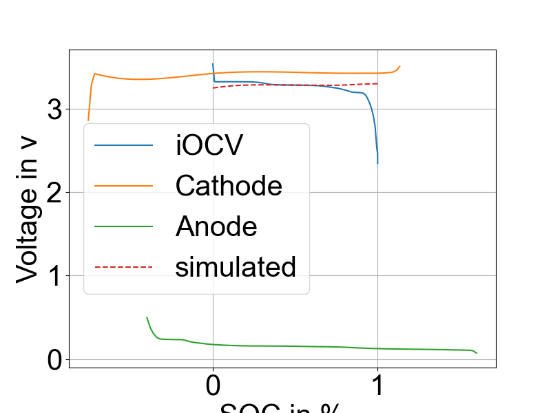

# BatDetector Bachelor Project

## Overview
This project determines the material composition of a full cell by reconstructing its incremental open-circuit voltage (iOCV). The reconstruction is based on the open-circuit voltage (OCV) data from half-cell anode and cathode measurements.

## Features
- Reconstructs the full-cell iOCV using half-cell anode/cathode OCP data.
- Analyzes the material composition of the full cell.
- Generates visual plots of the best matching half-cell pair, full-cell, and reconstructed voltage curves.
- Saves analysis results as CSV files for further evaluation.
- Prints analysis data to the console.

## Installation
Follow these steps to set up the environment and install dependencies:

1. Create a new virtual environment:
   ```sh
   python3 -m venv <env_name>
   ```
2. Activate the environment:
   - **Linux**:
     ```sh
     source <env_name>/bin/activate
     ```
   - **Windows**:
     ```sh
     .\<env_name>\Scripts\activate.bat
     ```
3. Install necessary packages:
   ```sh
   pip3 install -r requirements
   ```

## Usage
To execute the analysis, call the function `get_material(...)` in the `BatDetector.py` module. This function serves as the entry point for cell analysis.

1. Open a terminal and navigate to the `batDetector` directory:
   ```sh
   cd batDetector
   ```
2. Open `BatDetector.py` with a code editor and modify variables at the beginning of the file if necessary.
3. Load OCV data into a pandas DataFrame inside `__main__`. Example:
   ```python
   df_nmc = pd.read_csv(r"PATH/TO/FILE", sep=" ")
   ```
4. Call the function with parameters:
   ```python
   get_material(cell_cap, df_nmc, "LFP", "COBYLA", False)
   ```
   - The last parameter (`False`) is a boolean that determines whether additional information is printed on the output image.
5. Ensure the following directories exist in the base directory:
   - `halfCellAnodes`
   - `halfCellCathodes`
   - `results`
6. Run `BatDetector.py` from inside the `batDetector` folder.

At the end of the operation, all results are stored in the `results` folder or printed to the console.

## Output
- **Plot**: A visual representation of voltage curves.
- **CSV**: A file containing numerical results for further analysis.[03_01_2025_21_59_23COBYLA.csv](results/03_01_2025_21_59_23COBYLA.csv)

## Additional Information
- User can add their own half cell data into **halfCellAnodes** and **halfCellCathodes**
- keep the same format and header order of files